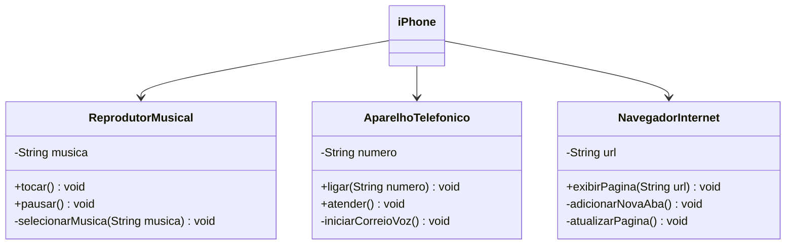

```mermaid
classDiagram
    class ReprodutorMusical {
        -String musica
        +tocar()  void 
        +pausar()  void 
        -selecionarMusica(String musica)  void
    }

    class AparelhoTelefonico {
        -String numero
        +ligar(String numero)  void
        +atender()  void
        -iniciarCorreioVoz()  void
    }

    class NavegadorInternet {
        -String url
        +exibirPagina(String url)  void
        -adicionarNovaAba()  void
        -atualizarPagina()  void
    }

    class iPhone {
    }

    iPhone --> ReprodutorMusical
    iPhone --> AparelhoTelefonico
    iPhone --> NavegadorInternet
```